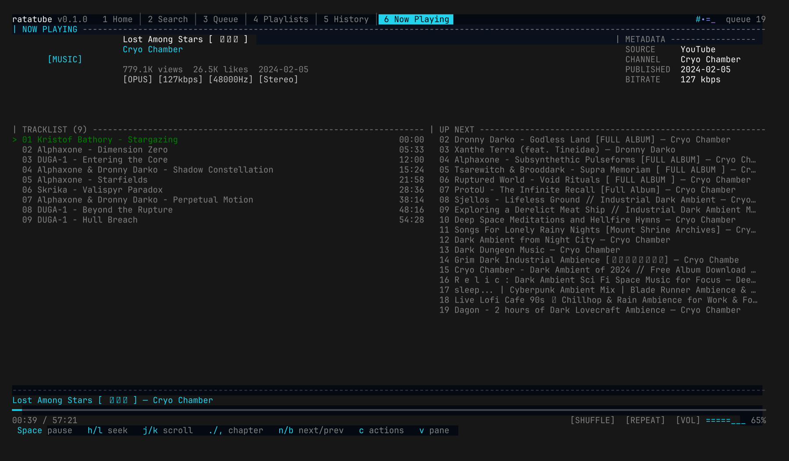
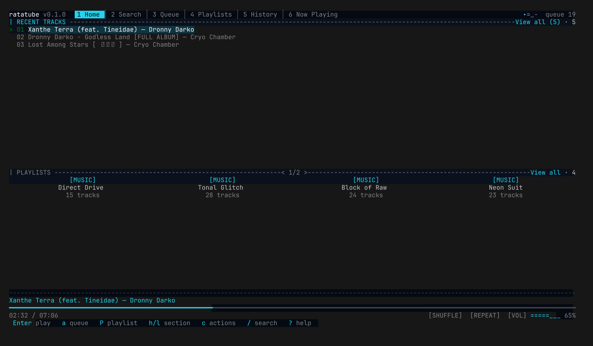
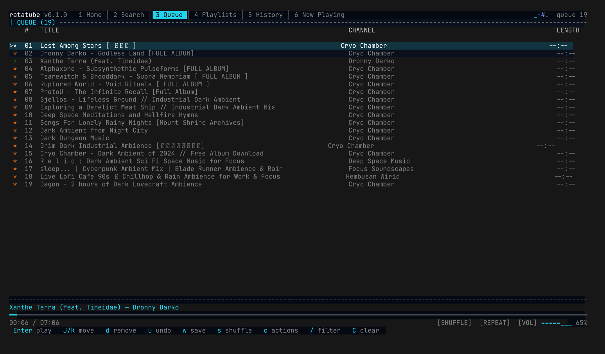
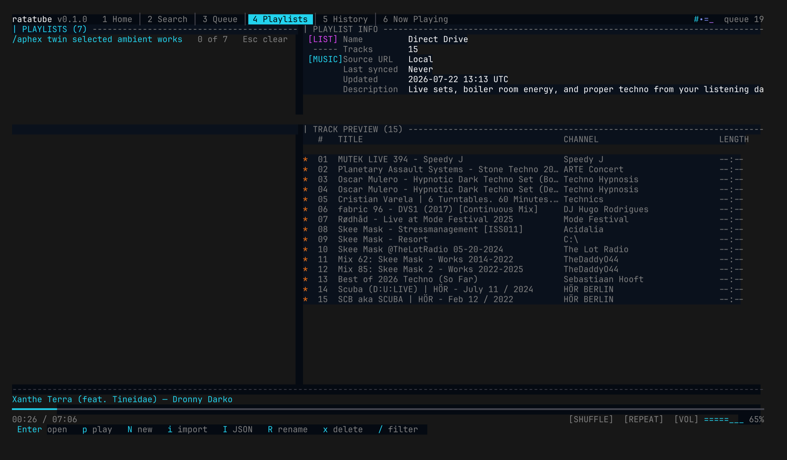
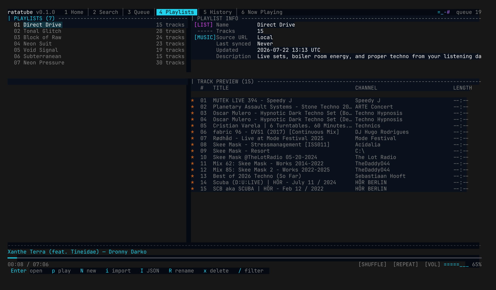

# ratatube

`ratatube` is a keyboard-first terminal application that searches YouTube, manages a local queue and playlists, and sends audio streams to a persistent `mpv` process. Playback lives in a background daemon, so the music keeps playing when the TUI closes. It is an unofficial client: it does not use a YouTube account, synchronize a library, remove ads, or guarantee that every video is playable.



<details>
<summary>More screenshots</summary>

**Home** — quick resume, recent tracks, and playlists survive daemon restarts:



**Queue** — the playing marker and cross-tab playlist markers:



**Search** — results with queued/playlist markers and a selected-track panel:



**Playlists** — master/detail with import support (URL or pasted JSON):



</details>

## Requirements

- Rust 1.88 or newer; the repository pins the verified toolchain in `rust-toolchain.toml`.
- `mpv` and `yt-dlp` on `PATH`, or absolute executable paths in the config.
- `curl` is optional and enables thumbnails. `ffmpeg` is optional but may be required by `mpv` for some formats.
- URL copying uses the first available platform clipboard tool: `pbcopy` on macOS, `wl-copy` on Wayland, or `xclip`/`xsel` on X11. The menu reports a bounded failure when none is available.
- An interactive terminal. The tested minimum is 80 columns by 24 rows; smaller terminals use a reduced layout.

Install platform packages first, then build:

```sh
cargo build --locked --release
./target/release/ratatube doctor
./target/release/ratatube
```

Use `/` to enter a search, type a query or supported YouTube URL, and press Enter. Select a result with `j`/`k` and press Enter to play. Press `?` for the complete scrollable command list. Immediate repeated `+`/`-` presses adjust volume cumulatively.

Press `c` on a track in Home, Search, Queue, a playlist, History, Channel, or Now Playing to open its non-blocking action menu. Playback continues while the menu is open; use `j`/`k`, Enter, and Esc. Available actions depend on the source and can include play now/next, queue or playlist insertion, channel browsing, details, browser opening, URL copying, and removal from the current queue or playlist occurrence.

While audio is playing, the playback bar shows a six-band level meter driven by real measurements from mpv's `astats` filter (RMS energy, peak, and spectral brightness); it disappears on pause and stop. Metering needs an mpv built with lavfi (any recent build); without it the meter stays hidden and playback is unaffected.

Channel browsing lists videos newest first in bounded pages of 30. Select the final `Load more` row and press Enter for the next page; a failed page becomes a `Retry` row. Backspace or Esc returns to the exact previous view. During the final 15 seconds of a track, the shared player rolls in the effective next title once; repeat-track and an empty next position suppress it.

## Background service

Playback runs in a background daemon; the TUI is a control layer that
attaches to it. Plain `ratatube` starts the daemon transparently when it is
not running and reattaches to the live session otherwise — quitting the TUI
leaves the music playing. `--standalone` runs the historic single process.

```sh
ratatube daemon     # run the service in the foreground (auto-spawn runs this)
ratatube play massive attack teardrop
ratatube status     # what is playing, from any terminal
ratatube pause
ratatube stop
ratatube quit       # stop the service (flushes persistence, stops mpv)
ratatube --resume
```

The control socket is `ratatube.sock` (mode 0600) in the data directory and
doubles as the single-instance lock; `doctor` reports daemon liveness. Any
number of TUIs and one-shot commands may attach at once. Very deep
`--data-dir` paths can exceed the platform Unix-socket path limit; the
error names the limit when that happens.

## Data and configuration

Platform-native directories are selected by the `directories` crate. Run `ratatube doctor` to print the exact paths without creating or changing them. For isolated runs, `--data-dir PATH` stores both config and application data under `PATH`.

Copy `config.example.json` to the reported `config.json` path and edit only documented fields. Unknown fields, future schema versions, unsafe limits, and malformed JSON are rejected. `resumeOnLaunch` accepts `off`, `paused`, or `playing`; `icons` accepts `auto`, `nerd-font`, or `ascii`.

`theme` selects one of sixteen theme families, each in a dark and a light variant with its scheme's official palette: `neon`/`neon-light`, `catppuccin-mocha`/`catppuccin-latte`, `solarized-dark`/`solarized-light`, `tokyo-night`/`tokyo-night-day`, `gruvbox-dark`/`gruvbox-light`, `nord`/`nord-light`, `dracula`/`alucard`, `one-dark`/`one-light`, `rose-pine`/`rose-pine-dawn`, `kanagawa-wave`/`kanagawa-lotus`, `everforest-dark`/`everforest-light`, `ayu-dark`/`ayu-light`, `night-owl`/`light-owl`, `github-dark`/`github-light`, `selenized-dark`/`selenized-light`, and `flexoki-dark`/`flexoki-light`.

Press `ctrl+p` in the app to open the settings menu: the Appearance tab walks the theme families with a live preview and `h`/`l` flips between dark and light, and the General tab edits icon and resume modes. Enter saves everything back to `config.json`; Esc cancels. Themes need a truecolor terminal; without one, every theme falls back to the shared basic-color palette.

Runtime files include `queue.json`, `history.json`, `session.json`, `playlists/*.json`, `ratatube.log`, and at most one rotated `ratatube.log.1`. Documents are bounded to 16 MiB. Malformed migrated documents may receive a `.bak` copy; future-schema documents are left unchanged.

## Recovery and diagnostics

Start with:

```sh
ratatube doctor
RUST_LOG=debug ratatube
```

`doctor` is read-only. It reports missing dependencies, malformed config, and path problems but does not create directories, logs, or backups. If config is malformed, move it aside or repair the reported JSON; the interactive app otherwise starts with defaults and preserves the original. If queue/history/session persistence fails, the UI explicitly warns that recent changes are not durable.

If `mpv` exits, the app performs three bounded reconnect attempts and reports failure. If the terminal is left in raw mode after an external kill, run `reset`. Network operations can fail because of YouTube changes, regional restrictions, deleted/private media, or outdated `yt-dlp`; update `yt-dlp` and retry.

## Development

See [CONTRIBUTING.md](CONTRIBUTING.md) for exact gates, [ARCHITECTURE.md](ARCHITECTURE.md) for ownership and invariants, [PRD.md](PRD.md) for the checked-in behavioral contract, and [dependencies.md](dependencies.md) for dependency rationale.

This repository currently has no selected software license and is marked `publish = false`. Distribution rights must be decided by the owner before release.
